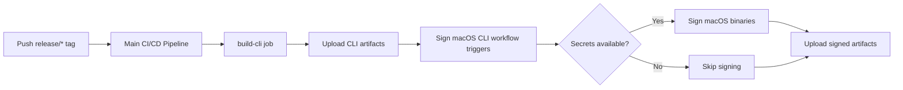

# macOS CLI Code Signing Implementation Summary

## What Was Done

### 1. Created Entitlements File

**File**: `apps/cli/entitlements.plist`

Created a minimal entitlements file with only the **3 essential permissions** required for the Packmind CLI:

```xml
- com.apple.security.cs.allow-jit
- com.apple.security.cs.allow-unsigned-executable-memory
- com.apple.security.cs.disable-executable-page-protection
```

These permissions are necessary because the CLI:

- Executes JavaScript detection programs dynamically (needs JIT)
- Loads and runs tree-sitter WASM parsers (needs unsigned memory)
- Uses Bun's runtime which requires these entitlements

**Security Note**: We intentionally **removed** these overly-permissive entitlements that were in the original Bun docs:

- ❌ `com.apple.security.cs.allow-dyld-environment-variables` (not needed)
- ❌ `com.apple.security.cs.disable-library-validation` (not needed)

### 2. Updated GitHub Actions Workflow

**File**: `.github/workflows/sign-macos-cli.yml`

- Changed runner to `depot-macos-15` (your specific macOS runner)
- Added repository checkout step to access the entitlements file
- Updated signing command to use `apps/cli/entitlements.plist`
- Workflow remains experimental and won't block main pipeline (`continue-on-error: true`)

### 3. Updated Build Workflow

**File**: `.github/workflows/build-proprietary.yml`

- Added artifact upload step for CLI executables
- Artifact name: `cli-executables-{run_number}-{sha}`
- This allows the signing workflow to download and sign the binaries

### 4. Updated Documentation

**File**: `apps/cli/README.md`

- Updated Code Signing section with detailed entitlements explanation
- Added commands for local signing and verification
- Referenced the production CI/CD signing workflow

**File**: `MACOS_SIGNING_SETUP.md`

- Comprehensive setup guide for GitHub Actions
- Detailed explanation of each entitlement and why it's needed
- Security context showing what the CLI does
- Step-by-step instructions for obtaining certificates

## Files Created/Modified

```
✅ apps/cli/entitlements.plist                    (NEW)
✅ .github/workflows/sign-macos-cli.yml           (NEW)
✅ .github/workflows/build-proprietary.yml        (MODIFIED)
✅ apps/cli/README.md                             (MODIFIED)
✅ MACOS_SIGNING_SETUP.md                         (NEW)
✅ MACOS_SIGNING_SUMMARY.md                       (NEW - this file)
```

## How It Works



**Important**: The signing workflow **only runs on `release/*` tags**, not on regular commits to main branch.

## Next Steps: Adding Secrets

To enable actual code signing, add these **3 secrets** to your GitHub repository:

### 1. `MACOS_CERTIFICATE`

```bash
# Export your Developer ID certificate as .p12, then:
base64 -i YourCertificate.p12 | pbcopy
# Paste the output as the secret value
```

### 2. `MACOS_CERTIFICATE_PASSWORD`

```
The password you used when exporting the .p12 file
```

### 3. `MACOS_SIGNING_IDENTITY`

```bash
# Find your signing identity:
security find-identity -v -p codesigning

# Use the full string in quotes, e.g.:
# "Developer ID Application: Packmind (ABC123XYZ)"
```

## Testing

### Without Secrets (Test Workflow Structure)

1. Create and push a `release/*` tag:
   ```bash
   git tag release/test-v0.0.1
   git push origin release/test-v0.0.1
   ```
2. Workflow runs but skips signing
3. Uploads unsigned artifacts
4. Verify workflow completes without errors

### With Secrets (Test Actual Signing)

1. Add the 3 secrets to GitHub
2. Create and push a `release/*` tag:
   ```bash
   git tag release/v1.0.0
   git push origin release/v1.0.0
   ```
3. Workflow signs macOS binaries
4. Download `cli-executables-signed-*` artifact
5. Run the executable - should work without warnings:
   ```bash
   ./packmind-cli-macos-arm64 lint --help
   ```

## Entitlements Rationale

The minimal entitlements were chosen based on:

1. **Analysis of CLI operations**:
   - Reads local files (default allowed)
   - Makes HTTP API calls (default allowed for outgoing)
   - Executes JavaScript dynamically (requires JIT)
   - Loads WASM parsers (requires unsigned memory)

2. **Bun runtime requirements**:
   - Bun's JavaScript engine needs JIT compilation
   - WASM execution needs unsigned executable memory
   - Memory management needs page protection control

3. **Security best practices**:
   - Only grant minimum required permissions
   - Remove development-only entitlements
   - Document why each permission is needed

## Maintenance

- **Entitlements file**: `apps/cli/entitlements.plist` can be modified if new permissions are needed
- **Workflow**: `.github/workflows/sign-macos-cli.yml` is isolated and can be disabled/removed without affecting other workflows
- **Documentation**: Keep `MACOS_SIGNING_SETUP.md` updated if the process changes

## References

- [Bun Code Signing Guide](https://bun.sh/docs/guides/runtime/codesign-macos-executable)
- [Apple Code Signing Documentation](https://developer.apple.com/documentation/security/code_signing_services)
- [macOS Entitlements Reference](https://developer.apple.com/documentation/bundleresources/entitlements)
